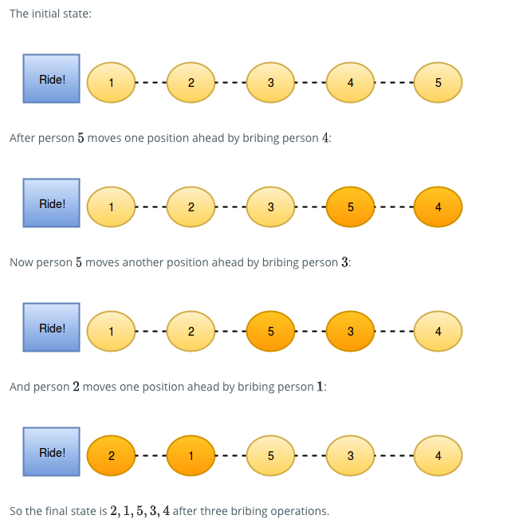

<!-- ∈ --> 
# New Year Chaos
It is New Year's Day and people are in line for the Wonderland rollercoaster ride. Each person wears a sticker indicating their initial position in the queue from  `1` to `n`. Any person can bribe the person directly in front of them to swap positions, but they still wear their original sticker. One person can bribe at most two others.

Determine the minimum number of bribes that took place to get to a given queue order. Print the number of bribes, or, if anyone has bribed more than two people, print **Too chaotic**.
## Example
`q = [1,2,3,5,4,6,7,8]`
If person `5` bribes person `4`, the queue will look like this: `1,2,3,5,4,6,7,8`. Only `1` bribe is required. Print 1.
`q = [4,1,2,3]`
Person `4` had to bribe `3` people to get to the current position. Print **Too chaotic**.

## Function Description

Complete the function **minimumBribes** in the editor below.

minimumBribes has the following parameter(s):

- int q[n]: the positions of the people after all bribes

**Returns**
- No value is returned. Print the minimum number of bribes necessary or *Too chaotic* if someone has bribed more than `2` people.

**Input Format**

The first line contains an integer `t`, the number of test cases.

Each of the next `t` pairs of lines are as follows:

- The first line contains an integer `t`, the number of people in the queue
- The second line has `n` space-separated integers describing the final state of the queue.

**Constraints**

   - `1 ≤ t ≤ 10`
   - `1 ≤ n ≤ 10^5`
   
***Subtasks***

   - For **60%** score `1 ≤ n ≤ 10^3`
   - For **100%** score `1 ≤ n ≤ 10^5`

### Sample Input
```html
STDIN           Function
-----           --------
2               t = 2
5               n = 5
2 1 5 3 4       q = [2, 1, 5, 3, 4]
5               n = 5
2 5 1 3 4       q = [2, 5, 1, 3, 4]
```
### Sample output
```html
3
Too chaotic
```
### Explanation
**Test Case 1**


**Test Case 2**

No person can bribe more than two people, yet it appears person `5` has done so. It is not possible to achieve the input state.